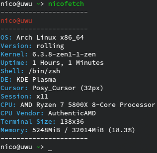

# nicofetch

is a universal, no frills fetch script written in Python,
currently it should work on Windows and Linux, with basic support for FreeBSD, and support macOS is work in progress.

# Usage

``nicofetch`` to fetch all available information,
you can add the argument ``--skip-platform`` if you don't want platform-specific info,
or ``--platform-only`` to only get platform-specific info.

